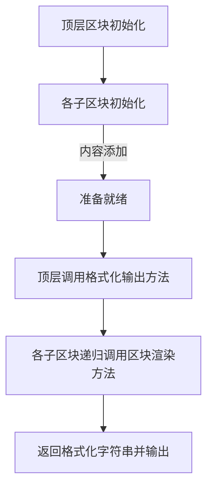

# Div Render

在一个 DivRender 中需要解决的问题是，将多个多行的Div处理显示在同一行中。

DivRender 需要处理两类问题，第一个问题是将复数个文字根据自身的宽高处理为一个文字区块。

第二个问题是将复数个区块根据自身的宽高处理为一个容器区块。

## 文字区块处理方式

首先获得文字的总数，将其按照宽度切分，进而得出需要的高度。

也就是说，在区块中，行宽的优先度高于列高。

## 区块初始化与内容设置

区块初始化通过`__init__()`方法实现，需要的参数有：

- 父区块：如果有区块使用`.register()`方法将其注册在其名下，则会调用该模块的`._set_parent_div()`方法将其设置为父区块。也可以在初始化时直接指定父区块。
  - 如果尝试将一个区块注册至其他区块下，则会导致抛出 ParentDivisionError。
- Style_parameters：以字典方式传入的参数，用于设定这个区块的属性，如尺寸，显示方式等。
  - height：以一行的高度为单位的高度，1表示一行，24表示24行。
  - width：以一个mono space的半角字符宽度为单位的宽度，全角字符占据两个半角字符的宽度。
  - display: 仿照 HTML 风格，当这个属性被设置为 `'float'` 时将会尝试与同一父区块的前一个div(如果有)在同一行显示。默认值为不尝试同行显示的 `'block'`。
  - content: 可以在初始化时直接给区块指定需要显示的内容，也可以通过 `.register()` 方法在初始化之后指定显示内容。这些内容必须可以使用字符串格式。
  - Container: 可以在初始化时直接以列表方式指定这个区块包含的子区块，这将使得本区块无视 content 中的内容，视自己为一个容器区块(`ContainerDivision`)。

## 区块渲染与格式化输出

在此对区块渲染与格式化输出进行定义。

区块渲染在此语境下是指生成符合本区块的字符串列表。列表中的每个元素皆是区块中的一行字，若某一行字符长度小于宽度，则使用空格补齐以保证每一格的字符串长度相等。

格式化输出在此语境下是指将区块渲染生成的字符串列表一行一行输出至控制台。

由此可知，格式化输出应当由根区块来进行，其他区块理论上都应该仅进行区块渲染。

一个界面的产生过程如下：

### 渲染器参数

渲染器需要参数有：

- 需要显示的信息，可以是纯字符串，也可以是字符串列表，甚至可以是子区块。
- debug选项：如果设置为开启，就会强制显示一些状态...吧
- 区块风格：比如宽高，显示方式等等

